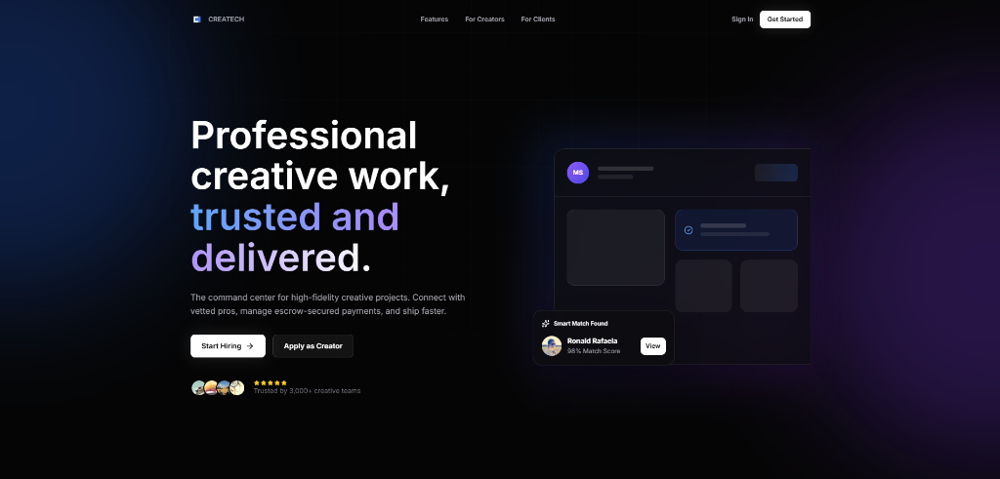
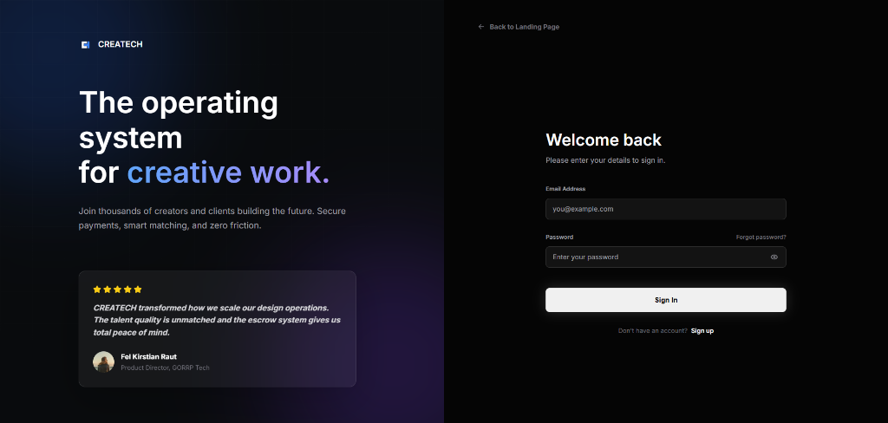
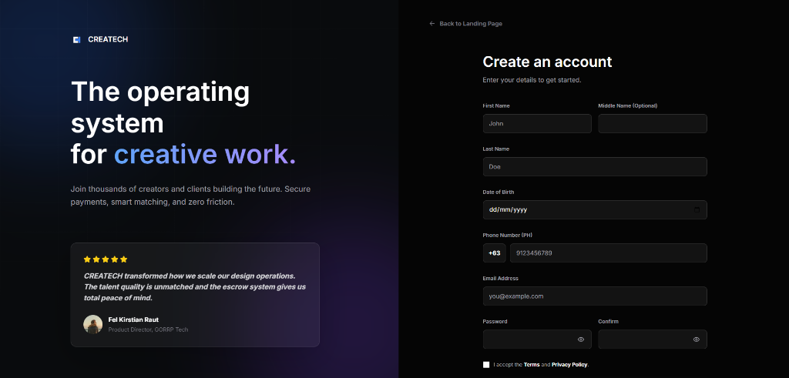
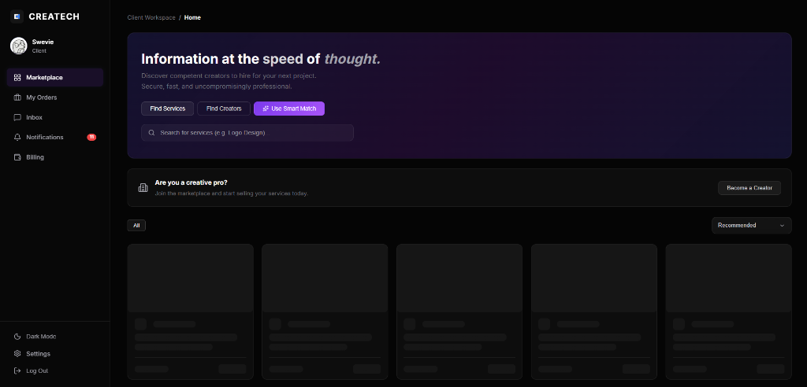
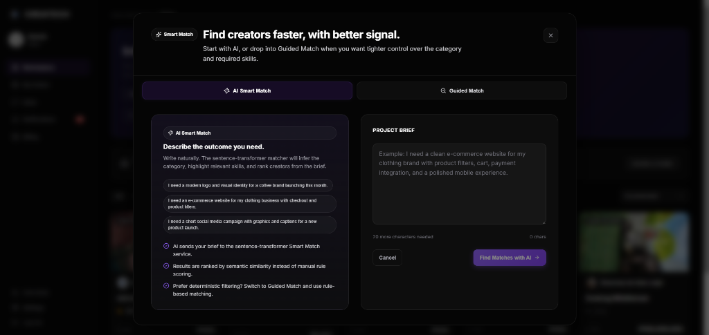
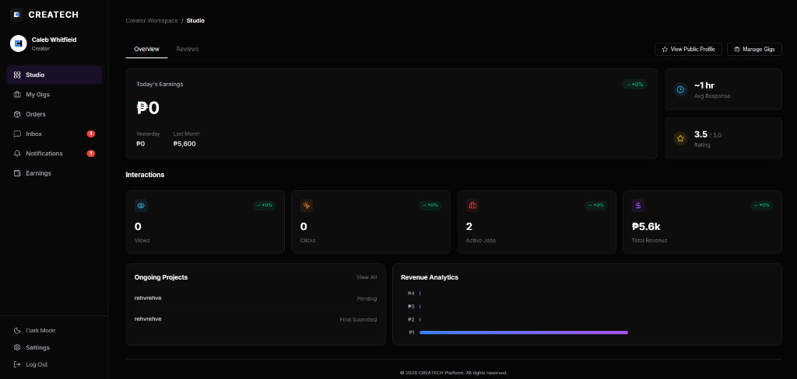

# CREATECH

## Project Description
CREATECH is the web application platform for connecting creators and clients. It provides a seamless interface for browsing services, managing projects, smart matching, and secure escrow payments.

## Features
- Client and Creator dedicated workspaces
- Service marketplace and custom orders
- AI-powered Smart Match for finding creators
- Real-time messaging and notifications
- Dispute resolution and review system
- Escrow-secured payment flows

## Technology Stack
- Framework: React + Vite
- Styling: TailwindCSS
- Routing: React Router
- State Management: Context API / Custom Hooks
- Backend API Integration: Axios

## Installation & Setup
1. Clone the repository.
2. Open the `AppDev` folder.
3. Install dependencies:

```powershell
npm install
```

4. Start the development server:

```powershell
npm run dev
```

5. Open your browser and navigate to the local server URL provided by Vite (usually `http://localhost:5173`).

## Deployment Link
- Live Backend API: `https://createch-backend-fastapi.onrender.com`
- API Docs: `https://createch-backend-fastapi.onrender.com/docs`
- Website Link: https://app-dev-khaki.vercel.app/
- Mobile Link: https://expo.dev/accounts/ralphjohnordizo/projects/createch-app/builds/279f07ad-3ba1-4c04-bb04-f92602a03a83?fbclid=IwY2xjawSDwS5leHRuA2FlbQIxMABicmlkETFJcDlxMkFmdDR1dk1CbDNIc3J0YwZhcHBfaWQQMjIyMDM5MTc4ODIwMDg5MgABHmi05wWC1cwhE3wAV_9rLNTqKo_2h3GhTRjG9PYZfxrwvsHQ9NI3Bi0XbqMO_aem_eW2LWF-j5cN4sNHrFVbdUw

## Test Account
ADMIN
admin.20260522@createch.app
CreatechAdmin!2026

CLIENT
rydigefo@mailinator.com
Pa$$w0rd!

CREATOR
fasixevyly@mailinator.com
Pa$$w0rd!

## Team Members and Roles
| Team Member | Role | Responsibilities |
| :--- | :--- | :--- |
| `Fel Kirstian Raut` | `` | `[Responsibilities]` |
| `Ralph John Ordiz` | `` | `[Responsibilities]` |
| `Ronald Rafaela` | `[Role]` | `[Responsibilities]` |
| `Stella Marie Galinada` | `[Role]` | `[Responsibilities]` |

## Known Limitations
- Storage limitations because it is using the cloudflare R2 for the storage of output
- The render is free tier therefore it sometimes slow to connect to the server

## Screenshots

### Landing Page


### Sign In


### Create Account


### Dashboard


### Smart Match


### Creator Studio

